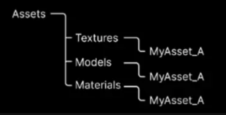
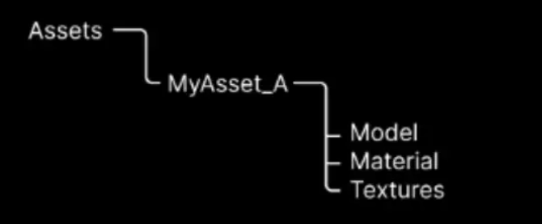

# Bulk upload CLI

The Bulk upload Command-Line Interface (CLI) is a cross-platform command-line tool to connect to Asset Manager and execute administrative commands. It allows you to create configuration files that you can save and run from a terminal. Using CLI, you can create and update assets in bulk from your local disk to Asset Manager based on several inputs to match your folder structure. This tool offers an interactive mode where you are prompted to provide the necessary information to create and save configuration files for future asset updates.

To connect and find support, join the [Help & Support page](https://cloud.unity.com/home/dashboard-support)!

## Table of contents
- [Bulk upload CLI](#bulk-upload-cli)
  - [Table of contents](#table-of-contents)
  - [Prerequisites](#prerequisites)
    - [System requirements](#system-requirements)
    - [Licenses](#licenses)
  - [How do I...?](#how-do-i)
    - [Install the tool](#install-the-tool)
    - [Run the tool in interactive mode](#run-the-tool-in-interactive-mode)
    - [Select the input method](#select-the-input-method)
  - [See also](#see-also)
  - [Tell us what you think!](#tell-us-what-you-think)

## Prerequisites

### System requirements

To run the script, you need:
- Blender 3.x installed on your machine
- An Asset Manager Contributor role on the project level or an Organization Owner role. For more information about roles, see [Roles and permissions](https://docs.unity.com/cloud/en-us/asset-manager/org-project-roles). You can upload up to 10 GB on the free tier of Unity Cloud.
- A Unity Cloud project with asset manager service enabled to upload assets. For more information on how to create a new project on Unity Cloud, see [Create a new project](https://docs.unity.com/cloud/en-us/asset-manager/new-asset-manager-project).
- An assigned seat if you are part of an entitled organization, that is, an organization with a Pro or Enterprise license. For more information, see the [Important notes](https://docs.unity.com/cloud/en-us/asset-manager/org-project-roles#project-level-roles) section.

### Licenses

The bulk download sample script is made available under the [Unity ToS license](./LICENSE.md).

## How do I...?

### Install the tool

1. Navigate to the current folder with your terminal.
2. Run the following help command to install the tool:
* On Mac: `python3 bulk-cli.py --install`
* On Windows: `python bulk-cli.py --install`

### Run the tool in interactive mode

1. Navigate to the current folder with your terminal.
2. Run the following command:
* On Mac: `python3 bulk-cli.py --create`
* On Windows: `python bulk-cli.py --create`

### Select the input method

Select one of the three strategies as the input method for bulk asset creation:

1. Answer the following CLI prompt: `Are you uploading assets from a Unity project?`
* Enter Yes if you upload files that are either:
  * In a Unity project and have .meta files from the editor
or:
  * In a Unity package, like content from the asset store

2. If you answered No to the prompt in step 1, select either of the following under the `Select a strategy` prompt:

* `group files by name`: Select this option if your assets are following a naming convention, for example, blueasset.fbx, blueasset.png.

* `group files by folder`: Select this option if your assets are organized by folder, that is, all relevant files are in distinct folders.

## See also

- [Unity Cloud Python SDK documentation](https://docs.unity.com/cloud/en-us/asset-manager/python-sdk)

## Tell us what you think!

Thank you for taking a look at the project! To help us improve and provide greater value, please consider providing feedback in our [Help & Support page](https://cloud.unity.com/home/dashboard-support). Thank you!