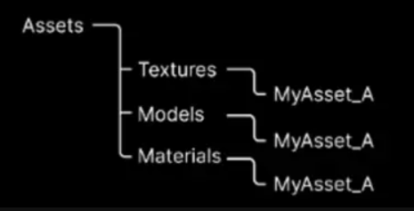
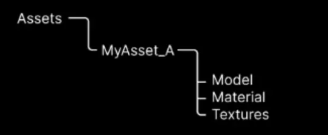

# Bulk upload CLI

The Bulk upload Command-Line Interface (CLI) is a cross-platform command-line tool to connect to Asset Manager and execute administrative commands. It allows you to create configuration files that you can save and run from a terminal. Using CLI, you can create and update assets in bulk from your local disk to Asset Manager based on several inputs to match your folder structure. This tool offers an interactive mode where you are prompted to provide the necessary information to create and save configuration files for future asset updates.

Find and connect support services on the [Help & Support](https://cloud.unity.com/home/dashboard-support) page.

## Table of contents
- [Bulk upload CLI](#bulk-upload-cli)
  - [Table of contents](#table-of-contents)
  - [Prerequisites](#prerequisites)
    - [Before you start](#before-you-start)
    - [Licenses](#licenses)
  - [How do I...?](#how-do-i)
    - [Install the tool](#install-the-tool)
    - [Run the tool in interactive mode](#run-the-tool-in-interactive-mode)
    - [Select the input method](#select-the-input-method)
	- [Validation step](#validation-step)
	- [Use the template.csv file for asset ingestion](#use-the-templatecsv-file-for-asset-ingestion)
	- [Creating a csv from a Unity Cloud project](#creating-a-csv-from-a-unity-cloud-project)
    - [Editing metadata in the csv file](#editing-metadata-in-the-csv-file)
    - [Use an existing configuration file](#use-an-existing-configuration-file)
  - [See also](#see-also)
  - [Tell us what you think](#tell-us-what-you-think)

## Prerequisites

> **Note**: To create and update assets from the CLI tool to Asset Manager, you need the [`Asset Manager Admin`](https://docs.unity.com/cloud/en-us/asset-manager/org-project-roles#organization-level-roles) role at the organization level or the [`Asset Manager Contributor`]( https://docs.unity.com/cloud/en-us/asset-manager/org-project-roles#project-level-roles) add-on role at the project level. Asset Manager Contributors can update assets only for the specific projects to which they have access. You can upload up to 10 GB on the free tier of Unity Cloud.

### Before you start

Before you create and update assets from the CLI tool to Asset Manager, make sure you have the following:

  - Python installed on your machine.
  - The required permissions. Read more about [verifying permissions](https://docs.unity.com/cloud/en-us/asset-manager/org-project-roles#verify-your-permissions).

   >  **Note**: Asset Manager roles define the permissions that you have for a single Asset Manager project. Depending on your work, permissions may vary across projects.

  - A Unity Cloud project with the Asset Manager service enabled to upload assets. Read more about [creating a project in Unity Cloud](https://docs.unity.com/cloud/en-us/asset-manager/new-asset-manager-project) page.
  - An assigned seat if you are part of an entitled organization, that is, an organization with a Pro license or an Enterprise license. Read more about [checking your assigned seat](https://docs.unity.com/cloud/en-us/asset-manager/org-project-roles#project-level-roles).

### Licenses

The bulk upload sample script is provided under the [Unity ToS license](../LICENSE.md).

## How do I...?

### Install the tool

1. Go to the current folder with your terminal.
2. Run the following help command to install the tool:

   * On Mac: `python3 bulk_cli.py --install`
   * On Windows: `python bulk_cli.py --install`

### Run the tool in interactive mode

1. Go to the current folder with your terminal.
2. Run the following command:

   * On Mac: `python3 bulk_cli.py --create`
   * On Windows: `python bulk_cli.py --create`

### Select the input method

If you have a CSV respecting the template, when prompted about it, you can select yes and provide the path to the CSV file. Otherwise, you will be prompted about your assets location.

Select one of the three strategies as the input method for bulk asset creation:

- **in a .unitypackage file**: Select this option if your assets are in a .unitypackage file. The tool extracts the assets from the .unitypackage file and uploads them to the cloud.
  * Provide the path to the .unitypackage file.
- **in a local unity project**: Select this option if your assets are in a local Unity project.
  * Provide the path to the asset folder of the Unity project.
- **in UnityCloud**: Select this option if your assets are in a Unity Cloud project.
  * Provide the organization ID and project ID. As of now, this features is solely to update tags and metadata of assets in the cloud. See section [Creating a csv from a Unity Cloud project](#creating-a-csv-from-a-unity-cloud-project) for more information.
- **in a folder**: Select this option if your assets are in a folder on your local machine.
  * Chose the grouping strategy for the assets:
    - group files by name: Select this option if your assets are following a naming convention, for example, blueasset.fbx, blueasset.png.

    - group files by folder: Select this option if your assets are organized by folder, that is, all relevant files are in distinct folders.

    - one file = one asset: Select this option if no grouping is necessary. Each file in the asset folder and its subfolders is created as an asset.
      - Confirm if you want automatic preview detection:
        - If you said yes: any picture file with the suffix `_preview` will be associated to the file of the same name as a preview.

### Validation step

Before creating assets and uploading their files to the cloud, the CLI tool displays the number of assets to be created and the total size in bytes of the files that will be uploaded. 
The tool prompts you to create a .csv file to review the upload plan. Edit the .csv file to modify the upload plan. If the results are not satisfactory, stop the process and start a new run.

>  **Note**: The .csv file created at this step is applicable for use in subsequent asset ingestions because it follows the required template.

### Use the template.csv file for asset ingestion

To manage and customize the upload of assets, create an upload plan as follows:

1. Go to the `template.csv` file in your project directory.
2. Fill out the `template.csv` to create an upload plan that allows customization at the asset level.
3. Run the CLI tool, and when prompted about having a .csv file, answer yes and link the .csv file that you created.
4. This process maps all your assets and their customizations. Update and reuse the same .csv file over time to manage your assets in the cloud.

### Creating a csv from a Unity Cloud project

To create a .csv file from a Unity Cloud project, follow these steps:
1. Run the CLI tool with the `--create` flag.
2. When prompted to chose where the assets are located, select `in Unity Cloud`.
3. Answer the next questions normally.
>  **Note**: The files won't be downloaded nor will they appear in the .csv file. Using the `Unity Cloud` assets source will only allow you to update assets tags and metadata.
>  **Note**: The collection won't appear in the csv as this is a known limitation at the moment. You can still edit this colum in the csv file to update the collection of the assets.

### Editing metadata in the csv file

The csv file generated by the CLI tool can be edited to update the metadata of the assets. To do so, you must add, in the csv, a column for each metadata you want to update. The column name must be the metadata name. The column name is the field definition key. The value of the cell must be the new value of the metadata.
To find the field definition key of a metadata, you can use directly the python SDK. Alternatively, you can create a csv file from a Unity Cloud project and look at the metadata column names for assets already containing the metadata you want to update.

Depending on the metadata type, the value of the cell must be formatted differently:
- For a number, the value must be a a valid number and written without quotes. (e.g. `42`)
- For a multi-select metadata, the value must be a valid json array of strings with single quotes. (e.g. `['value1', 'value2']`)
- For everything else, the value must be a string and written with quotes. (e.g. `"value"`)

### Use an existing configuration file

To use an existing configuration file, follow these steps:
1. Run the CLI tool with the `--create` flag.
2. At the end, when prompted to create a configuration file, answer yes and give it a name of your choice.
3. On the next run with the `--create` flag, you can add the `--config` flag followed by the name of the configuration file you created. All the answers you gave during the first run will be loaded from the configuration file.
4. Alternatively, you can use the `--config-select` flag to select a configuration file from the list of existing configuration files.

## See also
For more information, see the [Unity Cloud Python SDK](https://docs.unity.com/cloud/en-us/asset-manager/python-sdk) documentation.

## Tell us what you think

Thank you for exploring our project! Please help us improve and deliver greater value by providing your feedback in our [Help & Support](https://cloud.unity.com/home/dashboard-support) page. We appreciate your input!